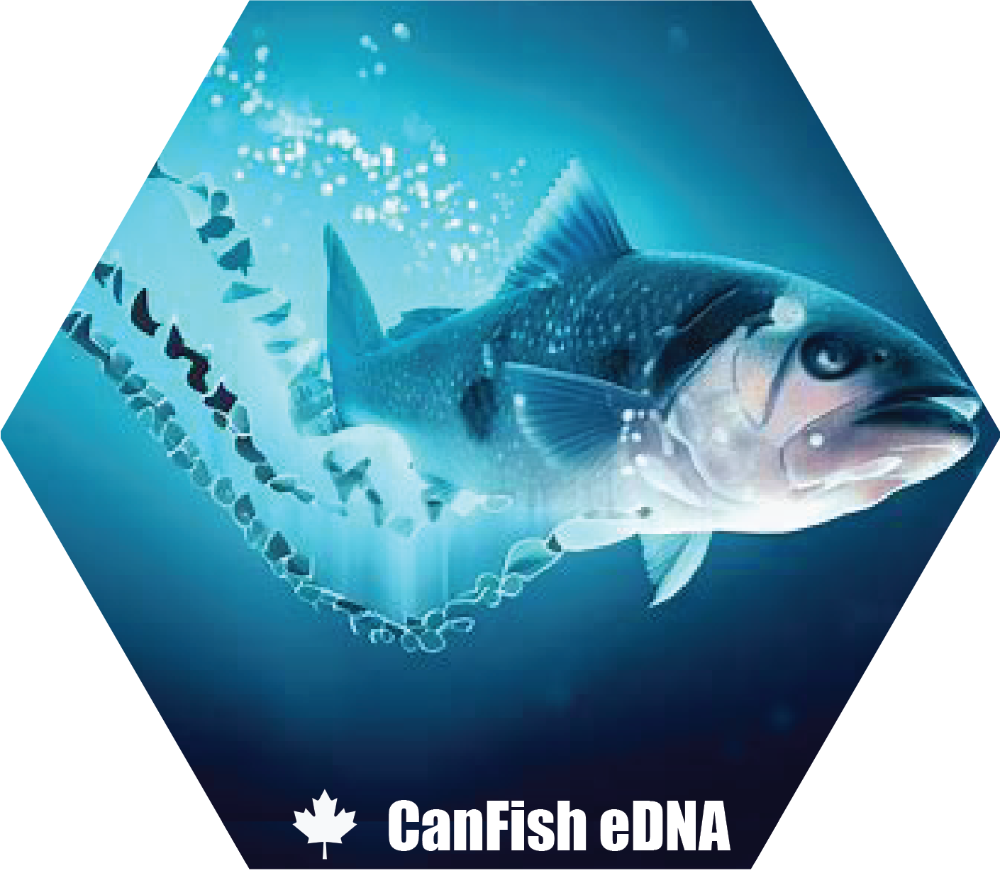

# CanFish - An environmental DNA reference database for Canadian Marine fish species using 12s and 16s genes.

 

Here are two custom DNA reference libraries for fish species (_Actinopterygii_ only) in Canada for the 12S and 16S amplicons described in [He et al., 2022](#he_ref). This library is focussed primarily on marine species in the Atlantic and Pacific oceans but also includes references for 143 Freshwater and 203 species located in the Arctic region. 

# **Citation**

Westfall, K.M., Abbot, C., Gilmore, S., He, X., Jeffery, N.J., Rubidge, E.R., and R.R.E. Stanley. CanFish - An evironmental DNA reference database for Canadian Marine fish species using 12s and 16s genes. 

***

These are reference libraries specifically constructed for amplicons of the following markers:

1.	12S modified MiFish ([Miya et al., 2015](#miya_ref)). 
    Forward primer = 5’- **CGTGCCAGCCACCGCGGTT** -3’ 
    Reverse primer = 5’- **CATAGTGGGGTATCTAATCCCAGTTTG** -3’ 

2.	16S Fish ([McInnes et al., 2017](#mcinnes_ref)). 
    Forward primer = 5’- **AGCGYAATCACTTGTCTYTTAA** -3’ 
    Reverse primer = 5’- **CRBGGTCGCCCCAACCRAA** -3’
    
They are formatted for use with the FuzzyID2 software package for taxonomic assignment ([Shi et al., 2018](#shi_ref)).

## File Descriptions:
1. **12S_reference_library_Actinopterygii.fasta**: is a fasta formatted file with headers formatted for use with FuzzyID2 software in the format of GBaccession_Family_Genus_Species. *Note that original Genbank Accession numbers are maintained with the exceptions detailed for shared haplotypes between species.

2. **12S_haplogroups_list.csv**: is a csv formatted file containing the list of haplotypes shared between species and genera. The header is formatted as (1) accession number change to group initials (2), followed by group number and 4 zeros and individual number. The rest of the header contains the Group Name for Family (i.e., Agonidae1) followed by the group code (i.e., AG1) followed by a unique species identifier that is sequential for all groups (i.e., species1). Each haplotype in a group will have the exact same Family, Genus and Species text to avoid any program error. For example, each entry for Agonidae1 group is AG100001_Agonidae1_AG1_species1, AG100002_Agonidae1_AG1_species1, and AG100003_Agonidae1_AG1_species1.

3. **16S_reference_library_Actinopterygii.fasta**: is a fasta formatted file with headers formatted for use with FuzzyID2 software in the format of GBaccession_Family_Genus_Species. *Note that original Genbank Accession numbers are maintained with the exceptions detailed for shared haplotypes between species.

4. **16S_haplogroups_list.csv**: is a csv formatted file containing the list of haplotypes shared between species and genera. The header is formatted as (1) accession number change to group initials (2), followed by group number and 4 zeros and individual number. The rest of the header contains the Group Name for Family (i.e. Agonidae1) followed by the group code (i.e. AG1) followed by a unique species identifier that is sequential for all groups (i.e. species1). Each haplotype in a group will have the exact same Family, Genus and Species text to avoid any program error. For example, each entry for Agonidae1 group is AG100001_Agonidae1_AG1_species1, AG100002_Agonidae1_AG1_species1, and AG100003_Agonidae1_AG1_species1.

5. **Coad_OBIS_fish_list_Canada.csv**: the final species list used as a template to gather region specific reference DNA sequences -> all species that spend at least part of their life cycle in marine or brackish waters in the Atlantic and Pacific Oceans within Canadian waters.

## The general overview of reference library construction

  &emsp;**Step 1.** [Determine species list for Actinopterygii for Canadian marine waters in Atlantic and Pacific Oceans.](#step1) 
  &emsp;**Step 2.** [Gather GenBank entries for genes and species of choice.](#step2) 
  &emsp;**Step 3.** [Perform in silico PCR on all entries.](#step3) 
  &emsp;**Step 4.** [Manually align entries that failed in silico PCR in **Step 2**.](#step4) 
  &emsp;**Step 5.** [Identify unique haplotypes and collapse entries.](#step5) 
  &emsp;**Step 6.** [Calculate 95% confidence intervals of intraspecific distances and generate list of GenBank accession numbers greater than the interval.](#step6) 
  &emsp;**Step 7.** [Visually inspect potential GenBank ID errors identified in Step 6 using Family level phylogenetic trees and remove entries from reference library.](#step7) 

Specific methods for reference library construction under numbered headings of general steps above.

***

**Step 1. Determine species list** <a name="step1"/> 

&emsp;The final list of marine species in Canada was comprised of the list derived from [OBIS](https://obis.org/) observations from within Canada and supplemented by a list of Canadian marine fish species compiled by Ichthyologist Brian Coad [website](http://www.briancoad.com/main.asp?page=whatsnew.asp). This list totals 1543 species in Actinopterygii and is available as [**Coad_OBIS_fish_list_Canada.csv**](https://github.com/dfo-mar-mpas/can_marinefish_ref/blob/main/data/Coad_OBIS_fish_list_Canada.csv).

**Step 2. Gather Genbank entries using NCBI E-Utilities** <a name="step2"/>

  &emsp;**2.1** _‘esearch’_ and _‘efetch’_ species names and gene names according to list. Include or do separate searches for alternate naming schemes (e.g., small/large ribosomal sub-unit). Specify GenBank format for downloads and do not download RefSeq entries as these are duplicates. 
  &emsp;**2.2** Note missing species by looking at files with zero size. 
  &emsp;**2.3** Concatenate all files into single GenBank formatted file.<a name="step2-3"/>  

**Step 3. Perform in _silico_ PCR** <a name="step3"/>

  &emsp;**3.1** Convert to obitools database. 
  &emsp;**3.2** Run ecoPCR for specific primers.<a name="step3-2"/>  
  &emsp;**3.3** Remove first 13 lines of output file.  
  &emsp;**3.4** Reformat into FuzzyID2 reference library fasta format.<a name="step3-4"/>  

**Step 4. Determine which entries failed _in silico_ PCR** <a name="step4"/>

  &emsp;**4.1**	Obtain list of gb accession numbers in concatenated file from [**step 3.2**](#step3-2). 
  &emsp;**4.2**	Obtain list of gb accession numbers in all GenBank downloaded sequences [(**step 2.3**)](#step2-3)  
  &emsp;**4.3**	Determine which accession numbers were cut by in silico PCR. 
  &emsp;**4.4**	Use list of accession numbers in _‘esearch’_ and _‘efetch’_ commands to download **fasta** format. 
  &emsp;**4.5**	Format concatenated file from [**step 2.3**](#step2-3) into a blast database and blast the extra sequences (downloaded in **step 4.3**). 
  &emsp;**4.6**	Take output and acquire the full header and sequence from the original query file [(**step 2.3**)](#step2-3). 
  &emsp;**4.7**	Separate output into batches and manually align. 
  &emsp;**4.8**	Format trimmed sequences for fuzzyid2 and add into file from step [**step 3.2**](#step3-4). 
  &emsp;**4.9**	Remove short sequences that are obviously cut-off and not natural length variation.<a name="step4-9"/>   

**Step 5. Identify unique haplotypes and collapse entries** <a name="step5"/>

&emsp;**5.1**	Align sequence file from [**step 4.9**](#step4-9).  
&emsp;**5.2** Use R package ‘haplotypes’ to discover unique haplotypes. Make sure to use raw genetic distances instead of identities.  
&emsp;**5.3**	Go through list of unique haplotypes and remove duplicates in the file obtained from [**step 4.9**](#step4-9) using the following rules:  

   &emsp;&emsp;_5.3.1_	 maximum of three entries for each unique haplotype per species.  
   &emsp;&emsp;_5.3.2_	 When a haplotype is shared between 2 or more species, record those species and form a group.  
   &emsp;&emsp;_5.3.3_	 Name group and change accession number to group initials (2), followed by group number and 4 zeros and individual number. The rest of the header contains the Group Name for Family (i.e., Agonidae1) followed by the group code (i.e., AG1) followed by a unique species identifier that is sequential for all groups (i.e. species1). Each haplotype in a group will have the exact same Family, Genus and Species text to avoid any program error. For example, each entry for Agonidae1 group is AG100001_Agonidae1_AG1_species1, AG100002_Agonidae1_AG1_species1, and AG100003_Agonidae1_AG1_species1.  

&emsp;**5.4**	All groups are potential GenBank errors, especially if they contain more than one genus or higher.  
&emsp;**5.5**	Parse all entries per group's Family in file from [**step 4.9**](#step4-9) (removing obvious large numbers of sequence duplicates to make tree readable), create phylogeny in R.  
&emsp;**5.6**	Inspect and remove all species that are obvious errors. <a name="step5-6"/>   

**Step 6. Calculate 95% cut-off value of intraspecific distances and generate list of GenBank accession numbers greater than cut-off.** <a name="step6"/>

**NOTE:** This step removes potential errors that weren’t caught by the group sharing in Step 5.4. In this step, only species with multiple haplotypes are examined to look at intraspecific variation. Then species with very high intraspecific variation are removed. It is important to note that this may inadvertently remove invasive species that come from very different source populations in the case of multiple incursion events or very cosmopolitan species with large geographic ranges and naturally high levels of intraspecific variation. In the latter situation, if there are many sequences available, remove sequences sourced from geographically distant individuals (e.g., European or Asian populations) if location information is present in the GenBank record. 

&emsp;**6.1**	Generate list of unique species/groups from file in [**step 5.6**](#step5-6). 
&emsp;**6.2**	Parse file from [**step 5.6**](#step5-6) for each species and create one new file for each species. 
&emsp;**6.3**	Align each species file separately using mafft. 
&emsp;**6.4**	Analyze each aligned species file in R (package ‘ape’), calculating intraspecific K2P distances min, mean, max, and stdev. 
&emsp;**6.5**	Calculate the grand mean of means and the average sd. Calculate 95% confidence interval as 4.5 average sd* of grand mean. [**Chebyshev’s inequality**](https://en.wikipedia.org/wiki/Chebyshev%27s_inequality) was used to determine the 95% confidence interval as the distribution of average pairwise intraspecific variation was heavily skewed towards zero. Calculate the average sd using the formula:  

Average S.D. = √ ((n1-1)s12 +  (n2-1)s2k + … +  (nk-1)sk2) /  (n1+n2 + … + nk – k)  

where nk: Sample size for kth group, sk: Standard deviation for _kth_ group, and k: Total number of groups 
&emsp;**6.6** Highlight each species with a max value greater than the 95% cut-off and generate a Family phylogeny. 

**Step 7. Visually inspect potential GenBank ID errors using phylogenetic trees and remove entries from reference library.** <a name="step7"/>

For each species that was identified outside of the range, a NJ tree for all sequences within the Family was generated and individual pairwise distance matrices were examined. Obvious outliers were identified as (1) single GenBank entries that were placed outside of a monophyletic species clade, (2) single GenBank entries that had genetic distances with all other conspecifics above the cutoff. In these cases, the single GenBank entry for that species was removed. Once removed, if each species fell within the 95% confidence interval, those haplotypes were retained. Less obvious outliers occurred in species with large distributions that may represent phylogeographic variation. The entire species was removed in these cases as we could not reasonably assume the cause of high intraspecific distance for any specific GenBank record. 

Unique haplotypes that were shared among species, genera, and families were also examined. All haplotypes shared among families were examined for outliers, which were obvious in all cases and those entries removed so each unique haplotype was shared at or below the genus level. Most cases where haplotypes were shared among species or genera were treated as groups where species level could not be resolved. This approach was favoured over including all species in an overall genus group as haplotype sharing only applied to a subset of species within a genus, offering the lowest level of taxonomic assignment possible. 

# **References**

He, X., Stanley, R., Rubidge, E., Jeffrey, N., Hamilton, L., Westfall, K.M., Gilmore, S., Roux, L-M., Gale, K., Heaslip, S., Abbott, C. 2022. Fish community surveys in eelgrass beds using both eDNA metabarcoding and seining: implications for biodiversity monitoring in the coastal zone. Canadian Journal of Fisheries and Aquatic Sciences, DOI: 10.1139/cjfas-2021-0215. [**link**](https://cdnsciencepub.com/doi/10.1139/cjfas-2021-0215) <a name="he_ref"/>

McInnes J.C., Jarman S.N., Lea M.-A., Raymond B., Deagle B.E., Phillips R.A., et al. 2017. DNA metabarcoding as a marine conservation and management tool: a circumpolar examination of fishery discards in the diet of threatened albatrosses. Front. Mar. Sci. 4: 277. [**link**](https://www.frontiersin.org/articles/10.3389/fmars.2017.00277/full) <a name="mcinnes_ref"/>

Miya M., Sato Y., Fukunaga T., Sado T., Poulsen J.Y., Sato K., et al. 2015. MiFish, a set of universal PCR primers for metabarcoding environmental DNA from fishes: detection of more than 230 subtropical marine species. R Soc. Open Sci. 2(7): 150088. [**link**](https://royalsocietypublishing.org/doi/10.1098/rsos.150088) <a name="miya_ref"/>

Shi Z.-Y., Yang C.-Q., Hao M., Wang X.-Y., Ward R.D., and Zhang A.-B. 2018. FuzzyID2: A software package for large data set species identification via barcoding and metabarcoding using hidden Markov models and fuzzy set methods. Mol. Ecol. Resour. 18(3): 666–675. [**link**](https://onlinelibrary.wiley.com/doi/10.1111/1755-0998.12738) <a name="shi_ref"/>
